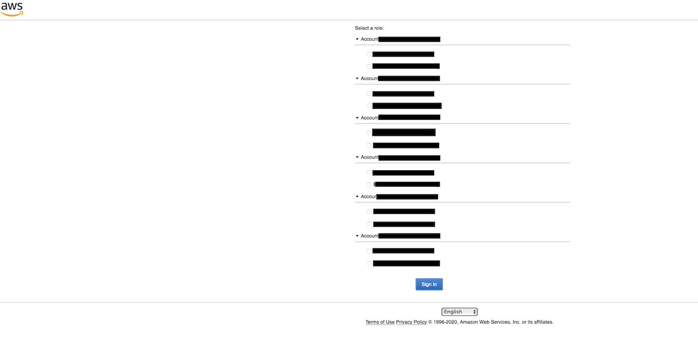

# AWS SAML to Temporary Credentials Bookmarklet

A [bookmarklet](https://en.wikipedia.org/wiki/Bookmarklet) that provides a way to retrieve AWS temporary credentials after authenticating to the AWS web console using a SAML SSO provider.  The bookmarklet invokes the AWS STS API to \"exchange\" an XML SAML Response for a set of temporary credentials in a form that can easily be used with command-line tools such the `aws` cli.

## Why would I want this?

You might want this if you don't use AWS IAM users, but have an AWS SAML SSO set up that provides for convenient and secure, role-based interactive access to the AWS web console, but you also want to be able to use command line tools to interact with your AWS accounts.  Without this bookmarklet (or a similar tool) you won't be able to get credentials to provide to command tools.    

## Other Options

### saml2aws

Another tool we are aware of that serves a similar purpose to this bookmarklet is [saml2aws](https://github.com/Versent/saml2aws).  

The difference between the bookmarklet and `saml2aws` is that `saml2aws` is command-line only and requires specific knowledge of your SSO/Identity Provider.  In our case, we have an extensible set of identity providers, and saml2aws doesn't necessarily "know" about them and it isn't feasible to develop and maintain integrations as these evolve over time. `saml2aws` does support authentication within KeyCloak (our SSO solution) when KeyCloak's internal identity store is user, but we delegate to external identity stores, and this is not supported.    The bookmarklet only needs to "know" about the structure of the AWS login page, and the AWS STS API, both of which should be fairly stable over time.

### hand-rolled 

Another approach is described on the [AWS Security Blog](https://aws.amazon.com/blogs/security/how-to-implement-a-general-solution-for-federated-apicli-access-using-saml-2-0/) that involves implementing "screen-scraping" logic in python based on your SSO's login flow and login form layout.  `saml2aws` is in part based on this approach, although `saml2aws` is an ongoing active open source project vs. a single blog post.      

##  How to Use

### Prerequisites/Assumptions

This bookmarklet is only going to be useful if you have a one or more AWS accounts with one or more roles each, accessible via a SAML SSO provider.  If you see a screen like the one below when you login to the AWS web console, the bookmarklet might be useful to you.

### Steps

* Visit [this](bookmarklet.html) page
* Follow instructions to add bookmarklet to a handy place in your bookmarks
* Once you've authenticated to AWS using a SAML SSO provider, and see a list of accounts + roles, invoke the bookmarklet
* A dialog will appear and after a few seconds it will display a text snippet that can be copied to your clipboard using a button within dialog.
* Open your favourite terminal application and paste the content of your clipboard into it
* Run `aws` cli or other command line, and the credentials you pasted in will be used to determine your role and associated, policy, within AWS etc. 
* Now, :muscle: !

## Getting Help or Reporting an Issue

If you have questions about this tool, a suggestion, or find a bug, please [Create an Issue](https://github.com/BCDevOps/aws-saml2sts-bookmarklet/issues/new).

## License

## Technical Details

Once added as a bookmark within a user's web browser, and invoked on the AWS SSO role selection page, this bookmarklet retrieves a set of temporary credentials that can be used in on the command line to interact with the AWS.

At dev/build time, plain Javascript is mashed (wrapped, minified, escaped, etc.) using the [`bookmarklet` library](https://www.npmjs.com/package/bookmarklet), which also produces a friendly [HTML page](bookmarklet.html) to make it easy for users to install the bookmarklet in their browsers.        

## Dependencies

### Runtime
* jQuery (MIT) 
* jQuery UI (MIT) 
* AWS Javascript client library 

### Development/Build Time

* [`bookmarklet` library](https://www.npmjs.com/package/bookmarklet)      

## Project Status
- [x] Development
- [x] Beta
- [ ] Production/Maintenance

## Documentation

You're looking at it :)

## Security

The bookmarklet is positioned as a more secure alternative to browser extensions to manage "userscripts" (such as TamperMonkey).  The code executes entirely within the user's browser, invoking the AWS API over a secure HTTPS connection when retrieving temporary credentials.  The code executes only when explicitly invoked by the user (in contrast with browser extensions which commonly require permissions that technically allows them to read all of the content displayed in a user's web browser.

## How to Contribute
 
If you would like to contribute, please see our [CONTRIBUTING](CONTRIBUTING.md) guidelines.

Please note that this project is released with a [Contributor Code of Conduct](CODE_OF_CONDUCT.md). 
By participating in this project you agree to abide by its terms.
